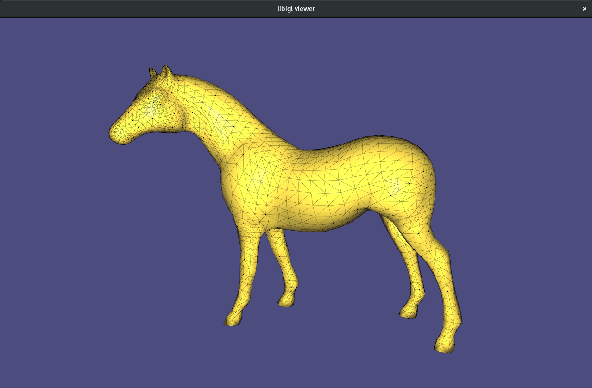

Triangular mesh viewer class using libigl (C++)
============================================

Simple implementation based on the tutorials.
--------------------------------------------------------------------------
To execute...
```sh
$ mkdir build
$ cd build
$ cmake ..
$ make -j2
$ cd VisualMesh-bin
$ ./VisualMesh ../../objects/horse_quad.obj
```
| Libraries | README |
| ------ | ------ |
| libgl | http://libigl.github.io/libigl/ |
| Eigen | http://eigen.tuxfamily.org |


> **About:**
> 
>- Project made and tested on Arch Linux
>

